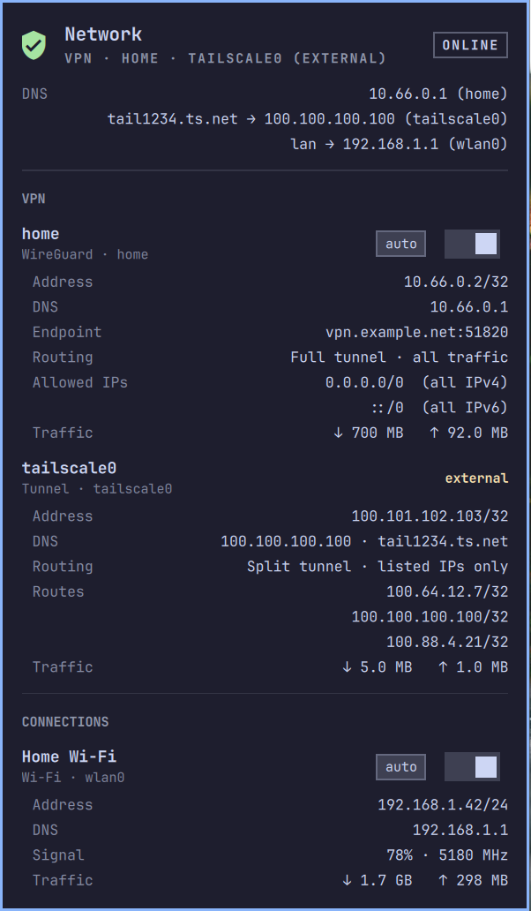
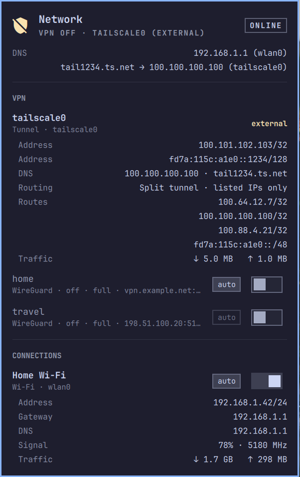
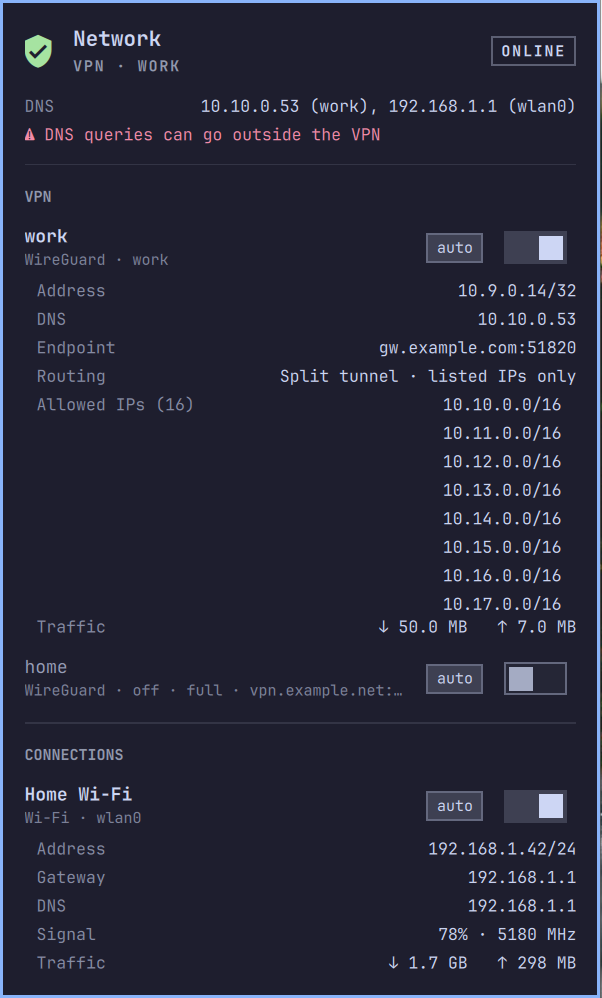
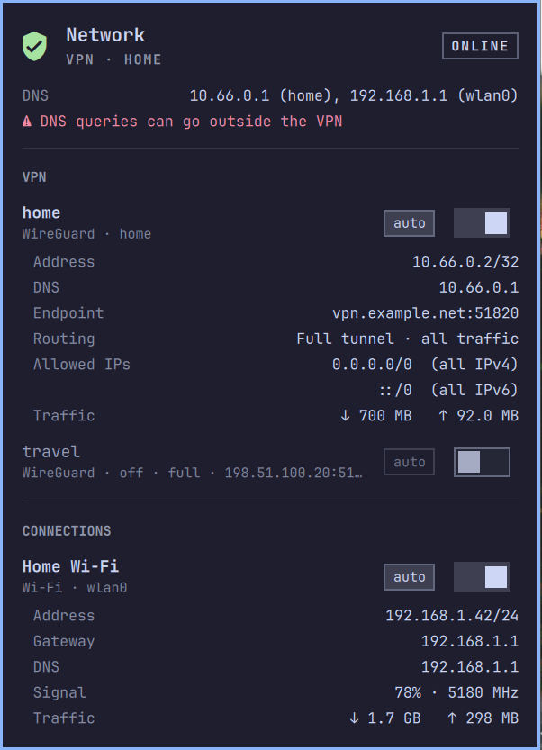

# io.github.roib.nmstatus — NetworkManager / VPN widget for the Omarchy bar

A bar icon that shows whether a VPN (WireGuard, OpenVPN, …) managed by
NetworkManager is up:

- **green shield with check**: at least one VPN is active
- **yellow shield**: no VPN, but a tunnel run by another program (e.g.
  Tailscale) is up
- **white shield with slash**: no VPN

| VPN up | Tailscale only |
|:---:|:---:|
|  |  |
| **Split tunnel, long route list** | **DNS outside a full tunnel** |
|  |  |

<sub>Screenshots use made-up data.</sub>

Hover for a one-line summary. Left-click opens a popup with:

- internet status (Online / No internet / Sign-in needed / Offline) and the DNS
  server(s) answering catch-all queries, with a warning if DNS can bypass an
  active full-tunnel VPN; split-DNS links (e.g. `tail1234.ts.net → 100.100.100.100`) are
  listed underneath
- every VPN profile: up/down switch, autoconnect switch, address, DNS,
  endpoint, full/split tunnel, allowed IPs / routes, uptime, traffic. Long
  route lists scroll in place and shrink to keep the popup on screen
- tunnels NetworkManager only mirrors ("connected (externally)", e.g.
  `tailscale0`) are shown read-only with an **external** tag: no switches,
  since toggling them from NetworkManager would fight their owner
- every other active connection (Wi-Fi, Ethernet, …): addresses, gateway, DNS,
  signal or link speed, up/down switch
- click any address/endpoint to copy it (`wl-copy`)
- "Open connection editor" if `nm-connection-editor` (from the
  `network-manager-applet` package) is installed

Right-click the icon to force a refresh. Updates are pushed via `nmcli monitor`,
with a polling fallback (`refreshIntervalSec`, default 10s).

Uptime is measured from when the widget saw the connection come up; for
connections already active when the shell started it shows "—".

## Requirements

NetworkManager, systemd-resolved (`resolvectl`), `jq` and `wl-copy` — all part
of a stock Omarchy install. Without systemd-resolved the DNS sections stay empty.
The tests also need `node`.

## Install

```bash
omarchy plugin add https://github.com/roib/nmconnection-omarchy --enable
```

`omarchy plugin update io.github.roib.nmstatus` pulls new versions. To place it next to
the built-in network icon:

```bash
omarchy bar move io.github.roib.nmstatus --section right --before omarchy.network
```

## Remove

```bash
omarchy plugin remove io.github.roib.nmstatus
```

This unloads the widget and deletes the plugin folder; it never touches your
NetworkManager connections.

## Development

Symlink a checkout instead of installing from git:

```bash
ln -s ~/Projects/nmconnection-omarchy ~/.config/omarchy/plugins/io.github.roib.nmstatus
omarchy-shell shell rescanPlugins
omarchy plugin enable io.github.roib.nmstatus
```

Hot-reload does not pick up edits made through the symlink; after editing
files here run `omarchy restart shell`.

`./nm-status | jq .` prints the raw data the widget renders.

## Tests

```bash
bash test/resolved.test.sh     # resolvectl parser (resolved.awk)
node --test test/model.test.js # Model.js helpers
```

## License

MIT — see [LICENSE](LICENSE).
